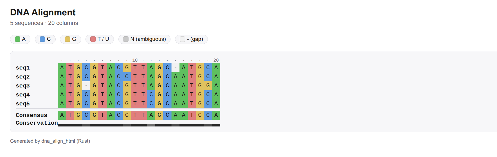

# alncolour

- Rust approach to color coded genome alignment from genome alignment, rna-seq alignment, fasta alignment.




```
cargo build
```

```
          _                          _                
   __ _  | |  _ __     ___    ___   | |   ___    _ __ 
  / _` | | | | '_ \   / __|  / _ \  | |  / _ \  | '__|
 | (_| | | | | | | | | (__  | (_) | | | | (_) | | |   
  \__,_| |_| |_| |_|  \___|  \___/  |_|  \___/  |_|   
                                                      

 sam bam genome alignment color coded
       ************************************************
       Author Gaurav Sablok,
       Email: gsablok@proton.me
      ************************************************

Usage: alncolour <COMMAND>

Commands:
  alignment-html      alignment to html
  sub-alignment-html  sub alignment to html
  help                Print this message or the help of the given subcommand(s)

Options:
  -h, --help     Print help
  -V, --version  Print version
```

